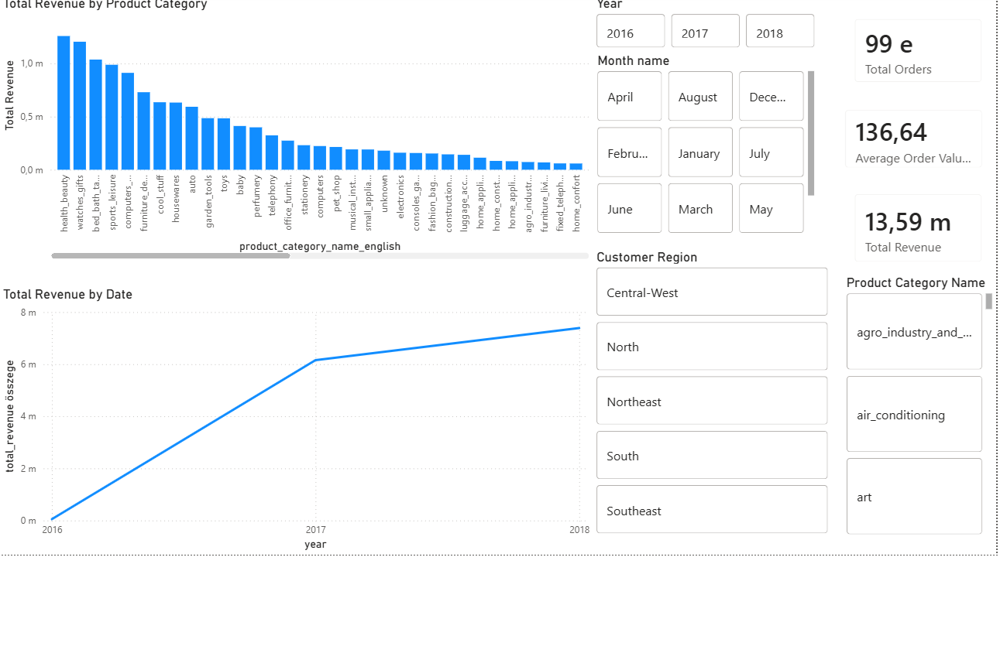
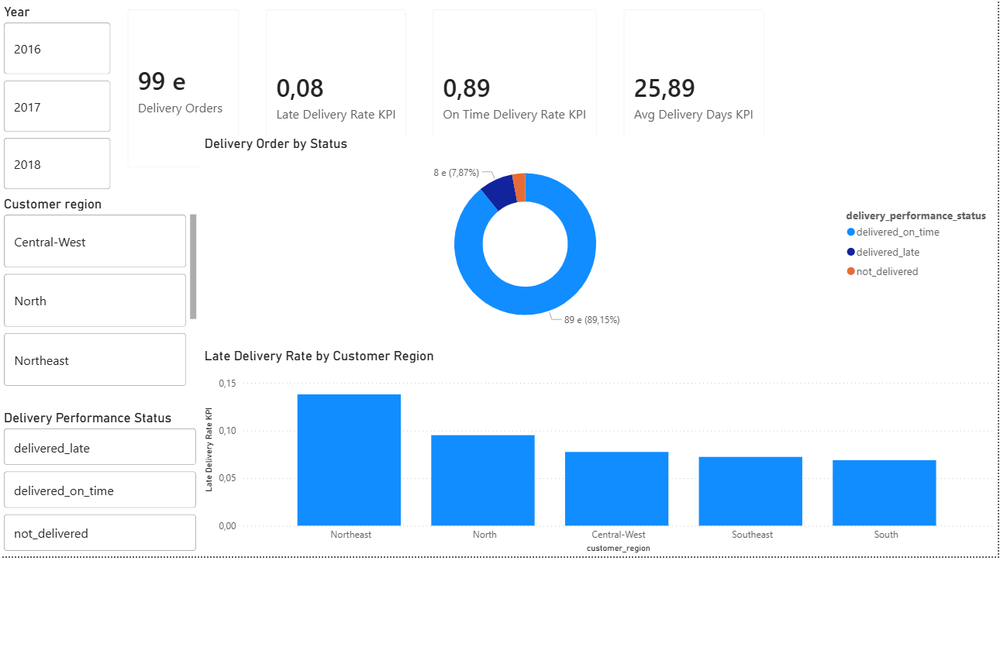
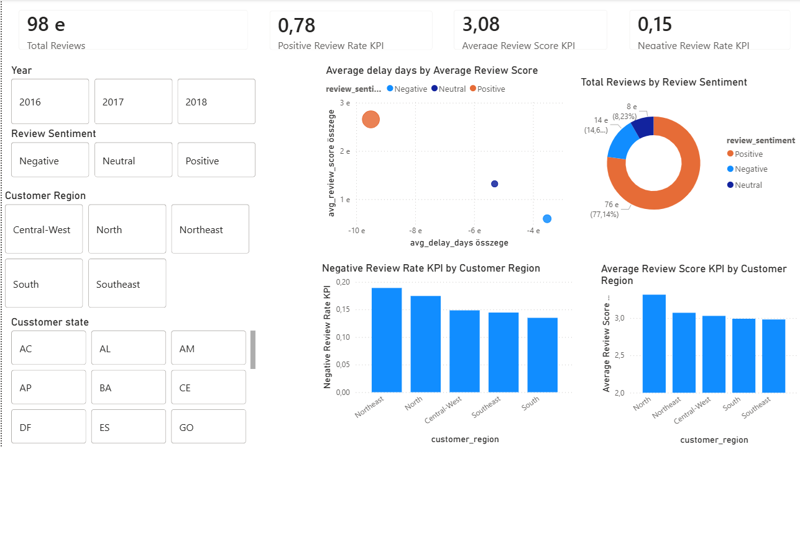
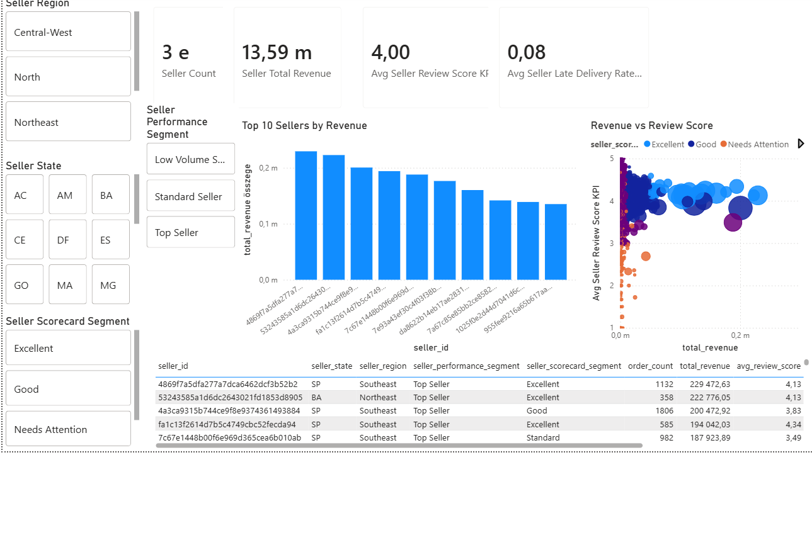

# End-to-End Brazilian E-Commerce Data Warehouse

## Project Overview

This project builds an end-to-end data warehouse using the **Olist Brazilian E-Commerce Public Dataset**.

The goal is to transform raw Kaggle CSV files into a clean, integrated and analytics-ready PostgreSQL data warehouse, then visualize business insights in Power BI.

The project covers the full data lifecycle:

```text
Raw CSV files
    ↓
PostgreSQL raw layer
    ↓
Staging layer
    ↓
Dimensional warehouse
    ↓
Business data marts
    ↓
Power BI dashboard
```

---

## Dashboard Preview

### Sales Overview



### Delivery Performance



### Customer Satisfaction



### Seller Scorecard




---

## Business Process

The analyzed business process is the **e-commerce order lifecycle**.

Main process steps:

1. Customer places an order
2. Payment is processed
3. Seller fulfills the order
4. Product is delivered
5. Customer leaves a review

The project covers:

- Sales performance analytics
- Delivery performance analytics
- Customer satisfaction analytics
- Seller performance analytics

---

## Tech Stack

- PostgreSQL
- Python
- Pandas
- psycopg2
- Power BI Desktop
- pgAdmin
- VS Code

---

## Data Architecture

```text
Kaggle CSV files
    ↓
raw schema
    ↓
staging schema
    ↓
warehouse schema
    ↓
mart schema
    ↓
Power BI dashboard
```

### Layers

| Layer | Purpose |
|---|---|
| `raw` | Stores the original CSV files in database tables without business transformation |
| `staging` | Cleans, standardizes and prepares the data |
| `warehouse` | Contains the dimensional data warehouse model |
| `mart` | Contains dashboard-ready aggregated business tables |
| `audit` | Stores ETL run logs and data quality check results |

---

## Key Features

- Raw, staging, warehouse, mart and audit layers
- Python ETL pipeline
- PostgreSQL dimensional data warehouse
- Star schema design
- Surrogate keys
- SCD Type 2 strategy for product and seller dimensions
- Data quality flags
- Audit logging
- Business data marts
- Power BI dashboard

---

## Main Fact Table Grain

The main fact table is:

```text
warehouse.fact_order_item
```

One row represents **one order item within an order**.

Natural grain:

```text
order_id + order_item_id
```

This means that if one order contains three products, then it appears as three rows in the main fact table.

---

## Main Data Marts

The final Power BI dashboard is based on the following data marts:

- `mart.sales_performance`
- `mart.delivery_performance`
- `mart.customer_satisfaction`
- `mart.seller_scorecard`

---

## Dashboard Pages

The Power BI report contains the following pages:

1. Sales Overview
2. Delivery Performance
3. Customer Satisfaction
4. Seller Scorecard

---

## Data Model Overview

The warehouse layer follows a dimensional star schema approach.

### Main fact tables

- `warehouse.fact_order_item`
- `warehouse.fact_payment`
- `warehouse.fact_review`
- `warehouse.fact_delivery`

### Main dimension tables

- `warehouse.dim_date`
- `warehouse.dim_customer`
- `warehouse.dim_product`
- `warehouse.dim_seller`
- `warehouse.dim_order_status`
- `warehouse.dim_payment_type`

---

## SCD Type 2 Strategy

The project applies SCD Type 2 logic to selected business attributes.

### Product dimension

SCD Type 2 attributes:

- `product_category_name_english`
- `product_weight_band`
- `product_size_band`

### Seller dimension

SCD Type 2 attributes:

- `seller_region`
- `seller_performance_segment`

The SCD Type 2 implementation uses the following technical fields:

- `valid_from`
- `valid_to`
- `is_current`
- `record_hash`

This allows the warehouse to preserve historical business classifications instead of overwriting old values.

---

## Data Quality Handling

The project does not automatically delete suspicious records. Instead, invalid or suspicious values are marked with data quality flags.

Examples:

- `has_invalid_price`
- `has_invalid_freight`
- `unknown` category values
- standardized city and state names
- mapped product category translations
- calculated delivery status fields

This makes data issues traceable and auditable.

---


## How to Run

### 1. Create PostgreSQL database

```sql
CREATE DATABASE olist_dw;
```

### 2. Install Python dependencies

```bash
pip install -r requirements.txt
```

### 3. Create `.env` file

Create a `.env` file based on `.env.example`.

Example:

```env
DB_HOST=127.0.0.1
DB_PORT=5432
DB_NAME=olist_dw
DB_USER=postgres
DB_PASSWORD=your_password
```

### 4. Place Kaggle CSV files into the raw data folder

```text
data/raw/
```

Expected files:

```text
olist_orders_dataset.csv
olist_order_items_dataset.csv
olist_order_payments_dataset.csv
olist_order_reviews_dataset.csv
olist_customers_dataset.csv
olist_products_dataset.csv
olist_sellers_dataset.csv
olist_geolocation_dataset.csv
product_category_name_translation.csv
```

### 5. Run SQL and ETL scripts

Run the scripts in the following order:

```bash
psql -U postgres -d olist_dw -f sql/01_create_schemas.sql
psql -U postgres -d olist_dw -f sql/02_create_raw_tables.sql
psql -U postgres -d olist_dw -f sql/03_create_audit_tables.sql
python scripts/01_load_raw.py
psql -U postgres -d olist_dw -f sql/04_create_staging_tables.sql
psql -U postgres -d olist_dw -f sql/06_create_warehouse_tables.sql
psql -U postgres -d olist_dw -f sql/08_create_additional_facts.sql
psql -U postgres -d olist_dw -f sql/10_create_marts.sql
```

---

## Dataset

Dataset: **Olist Brazilian E-Commerce Public Dataset**

Source: Kaggle

> Note: Raw data files are included in this repository.  

---

## Project Result

As a result of the project, a complete e-commerce data warehouse was created.

The project:

- integrates multiple raw CSV files
- cleans and standardizes the data through a staging layer
- builds a dimensional warehouse model
- uses surrogate keys
- applies SCD Type 2 strategy
- creates business-ready data marts
- supports business decision-making with Power BI dashboards

---


